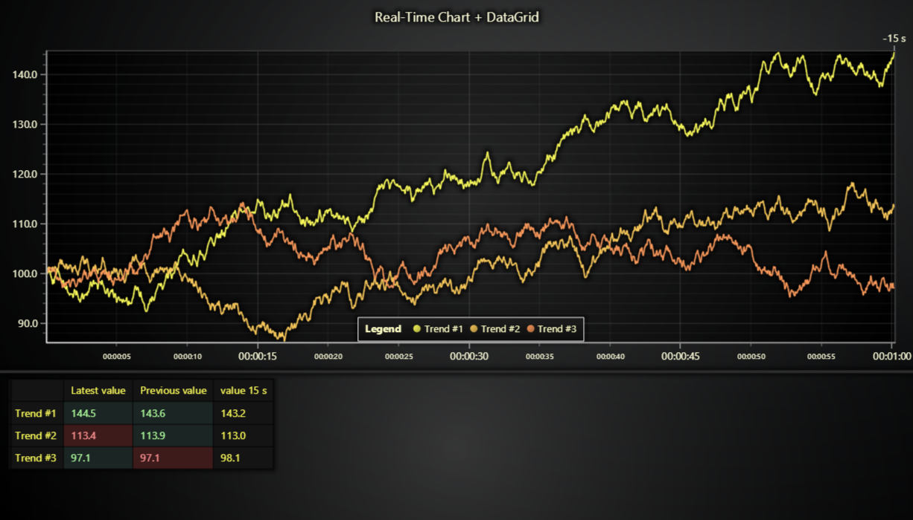

# JavaScript Monitoring Data Grid Heatmap

This demo application belongs to the set of examples for LightningChart JS, data visualization library for JavaScript.

LightningChart JS is entirely GPU accelerated and performance optimized charting library for presenting massive amounts of data. It offers an easy way of creating sophisticated and interactive charts and adding them to your website or web application.

The demo can be used as an example or a seed project. Local execution requires the following steps:

-   Make sure that relevant version of [Node.js](https://nodejs.org/en/download/) is installed
-   Open the project folder in a terminal:

          npm install              # fetches dependencies
          npm start                # builds an application and starts the development server

-   The application is available at _http://localhost:8080_ in your browser, webpack-dev-server provides hot reload functionality.

## Description

Example showcasing use of LightningChart JS Data Grid in a real-time monitoring use case.

This application simulates real-time data coming in at high speed.
Data is then displayed both in a scrolling line chart and a Data Grid.

More specifically, this example highlights the use of Data Grid text and background coloring to highlight the meaning of data. For example, red color may indicate a bad value. Human eye is quite bad at perceiving meaning of trend data (like in line charts), whereas brightly colored indicators can be very fast to understand. However, the use is very case specific.

For more information about LightningChart JS Data Grid, click [here](https://lightningchart.com/js-charts/datagrid/)

## API Links

* [Data Grid]
* [Chart XY]

## Support

If you notice an error in the example code, please open an issue on [GitHub][0] repository of the entire example.

Official [API documentation][1] can be found on [LightningChart][2] website.

If the docs and other materials do not solve your problem as well as implementation help is needed, ask on [StackOverflow][3] (tagged lightningchart).

If you think you found a bug in the LightningChart JavaScript library, please contact support@lightningchart.com.

Direct developer email support can be purchased through a [Support Plan][4] or by contacting sales@lightningchart.com.

[0]: https://github.com/Arction/
[1]: https://lightningchart.com/lightningchart-js-api-documentation/
[2]: https://lightningchart.com
[3]: https://stackoverflow.com/questions/tagged/lightningchart
[4]: https://lightningchart.com/support-services/

© LightningChart Ltd 2009-2022. All rights reserved.

[Data Grid]: https://lightningchart.com/js-charts/api-documentation/v5.0.1/classes/DataGrid.html
[Chart XY]: https://lightningchart.com/js-charts/api-documentation/v5.0.1/classes/ChartXY.html

